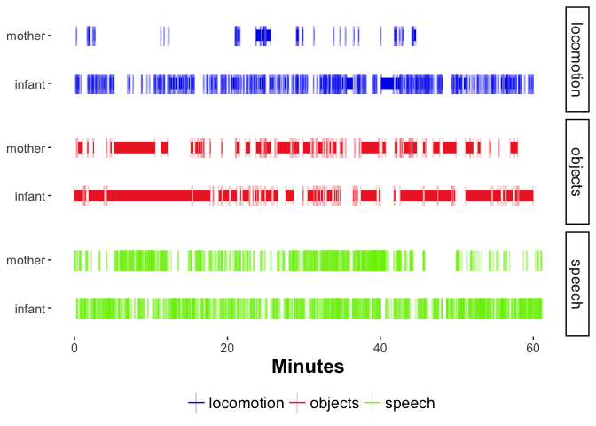
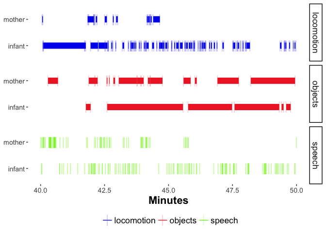
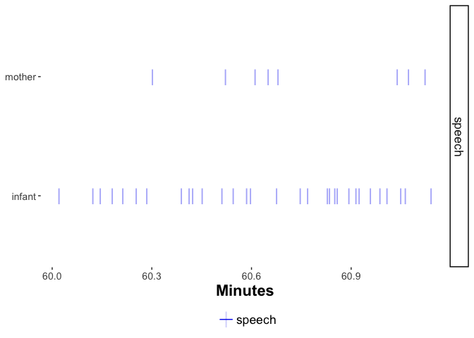

timeline-report
================
Rick Gilmore
2018-04-06 09:39:26

Purpose
-------

This document generates timelines for the PLAY project participants from CSVs generated from the Datavyu files.

Import
------

``` r
fl <- list.files(path = csv.dir, pattern = "\\.csv$", full.names = TRUE)
```

Clean single Datavyu file
-------------------------

``` r
sub.id <- params$sub.id
fn <- paste0(csv.dir, sub.id, ".csv")
dv <- read.csv(fn, stringsAsFactors = FALSE)

# Locomotion
dv %>%
  select(., babyloc.ordinal, babyloc.onset, babyloc.offset) %>%
  filter(., !is.na(babyloc.ordinal), !is.na(babyloc.onset), !is.na(babyloc.offset)) %>%
  gather(., key = event, value = time.ms, -babyloc.ordinal) %>%
  mutate(., event = str_extract(event, "[onsetf]+$")) %>%
  mutate(., ordinal = paste0('b.loc.', babyloc.ordinal)) %>%
  mutate(., person = "infant") %>%
  select(-babyloc.ordinal) %>%
  arrange(., time.ms) ->
  dv.babyloc

dv %>%
  select(., momloc.ordinal, momloc.onset, momloc.offset) %>%
  filter(., !is.na(momloc.ordinal), !is.na(momloc.onset), !is.na(momloc.offset)) %>%
  gather(., key = event, value = time.ms, -momloc.ordinal) %>%
  mutate(., event = str_extract(event, "[onsetf]+$")) %>%
  mutate(., ordinal = paste0('m.loc.', momloc.ordinal)) %>%
  mutate(., person = "mother") %>%
  select(-momloc.ordinal) %>%
  arrange(., time.ms) ->
  dv.momloc

dv.loc <- rbind(dv.babyloc, dv.momloc)
dv.loc$domain = "locomotion"

# Objects
dv %>%
  select(., babyobject.ordinal, babyobject.onset, babyobject.offset) %>%
  filter(., !is.na(babyobject.ordinal), !is.na(babyobject.onset), !is.na(babyobject.offset)) %>%
  gather(., key = event, value = time.ms, -babyobject.ordinal) %>%
  mutate(., event = str_extract(event, "[onsetf]+$")) %>%
  mutate(., ordinal = paste0('b.obj.', babyobject.ordinal)) %>%
  mutate(., person = "infant") %>%
  select(-babyobject.ordinal) %>%
  arrange(., time.ms) ->
  dv.babyobj

dv %>%
  select(., momobject.ordinal, momobject.onset, momobject.offset) %>%
  filter(., !is.na(momobject.ordinal), !is.na(momobject.onset), !is.na(momobject.offset)) %>%
  gather(., key = event, value = time.ms, -momobject.ordinal) %>%
  mutate(., event = str_extract(event, "[onsetf]+$")) %>%
  mutate(., ordinal = paste0('m.obj.', momobject.ordinal)) %>%
  mutate(., person = "mother") %>%
  select(-momobject.ordinal) %>%
  arrange(., time.ms) ->
  dv.momobj

dv.obj <- rbind(dv.babyobj, dv.momobj)
dv.obj$domain = "objects"

# Speech
dv %>%
  select(., babyvoc.ordinal, babyvoc.onset, babyvoc.offset) %>%
  filter(., !is.na(babyvoc.ordinal), !is.na(babyvoc.onset), !is.na(babyvoc.offset)) %>%
  gather(., key = event, value = time.ms, -babyvoc.ordinal) %>%
  mutate(., event = str_extract(event, "[onsetf]+$")) %>%
  mutate(., ordinal = paste0('b.voc.', babyvoc.ordinal)) %>%
  mutate(., person = "infant") %>%
  select(-babyvoc.ordinal) %>%
  arrange(., time.ms) ->
  dv.babyvoc

dv %>%
  select(., momspeech.ordinal, momspeech.onset, momspeech.offset) %>%
  filter(., !is.na(momspeech.ordinal), !is.na(momspeech.onset), !is.na(momspeech.offset)) %>%
  gather(., key = event, value = time.ms, -momspeech.ordinal) %>%
  mutate(., event = str_extract(event, "[onsetf]+$")) %>%
  mutate(., ordinal = paste0('m.voc.', momspeech.ordinal)) %>%
  mutate(., person = "mother") %>%
  select(-momspeech.ordinal) %>%
  arrange(., time.ms) ->
  dv.momspeech

dv.voc <- rbind(dv.babyvoc, dv.momspeech)
dv.voc$domain = "speech"

dv.combined <- rbind(dv.loc, dv.obj, dv.voc)
dv.combined %>%
  arrange(time.ms) ->
  dv.combined

# Cut by 10 min segments
ms.sec <- 1000
sec.min <- 60
dv.combined %>%
  mutate(minute.block = cut(time.ms, c(0, 10*sec.min*ms.sec,
                                       20*sec.min*ms.sec,
                                       30*sec.min*ms.sec,
                                       40*sec.min*ms.sec,
                                       50*sec.min*ms.sec,
                                       60*sec.min*ms.sec,
                                       max(time.ms)),
                            labels = c("0-10min", "10-20min","20-30min",
                                       "30-40min", "40-50min", "50-60min", "60min+"))) ->
  dv.combined
```

Plot of NYU019 full session
---------------------------

``` r
# http://sape.inf.usi.ch/quick-reference/ggplot2/shape for shape codes

dv.combined %>%
  # filter(minute.block == "2nd10") %>%
  ggplot() +
  aes(x = (time.ms)/(60*1000), y = person, group = ordinal, color = domain) +
  geom_point(shape = 124, size=6, alpha = 0.2) +
  geom_line(aes(size = 1)) +
  facet_grid(domain ~ .) +
  xlab("Minutes") +
  scale_shape_identity() +
  guides(size = FALSE) +
  theme_classic() +
  theme(legend.position = "bottom")
```



Plot of NYU019 0-10 min
-----------------------

``` r
# http://sape.inf.usi.ch/quick-reference/ggplot2/shape for shape codes

dv.combined %>%
  filter(minute.block == "0-10min") %>%
  ggplot() +
  aes(x = (time.ms)/(60*1000), y = person, group = ordinal, color = domain) +
  geom_point(shape = 124, size=6, alpha = 0.2) +
  geom_line(aes(size = 1)) +
  facet_grid(domain ~ .) +
  xlab("Minutes") +
  scale_shape_identity() +
  guides(size = FALSE) +
  theme_classic() +
  theme(legend.position = "bottom")
```


Plot of NYU019 10-20 min
------------------------

``` r
# http://sape.inf.usi.ch/quick-reference/ggplot2/shape for shape codes

dv.combined %>%
  filter(minute.block == "10-20min") %>%
  ggplot() +
  aes(x = (time.ms)/(60*1000), y = person, group = ordinal, color = domain) +
  geom_point(shape = 124, size=6, alpha = 0.2) +
  geom_line(aes(size = 1)) +
  facet_grid(domain ~ .) +
  xlab("Minutes") +
  scale_shape_identity() +
  guides(size = FALSE) +
  theme_classic() +
  theme(legend.position = "bottom")
```


Plot of NYU019 20-30 min
------------------------

``` r
# http://sape.inf.usi.ch/quick-reference/ggplot2/shape for shape codes

dv.combined %>%
  filter(minute.block == "20-30min") %>%
  ggplot() +
  aes(x = (time.ms)/(60*1000), y = person, group = ordinal, color = domain) +
  geom_point(shape = 124, size=6, alpha = 0.2) +
  geom_line(aes(size = 1)) +
  facet_grid(domain ~ .) +
  xlab("Minutes") +
  scale_shape_identity() +
  guides(size = FALSE) +
  theme_classic() +
  theme(legend.position = "bottom")
```


Plot of NYU019 30-40 min
------------------------

``` r
# http://sape.inf.usi.ch/quick-reference/ggplot2/shape for shape codes

dv.combined %>%
  filter(minute.block == "30-40min") %>%
  ggplot() +
  aes(x = (time.ms)/(60*1000), y = person, group = ordinal, color = domain) +
  geom_point(shape = 124, size=6, alpha = 0.2) +
  geom_line(aes(size = 1)) +
  facet_grid(domain ~ .) +
  xlab("Minutes") +
  scale_shape_identity() +
  guides(size = FALSE) +
  theme_classic() +
  theme(legend.position = "bottom")
```


Plot of NYU019 40-50 min
------------------------

``` r
# http://sape.inf.usi.ch/quick-reference/ggplot2/shape for shape codes

dv.combined %>%
  filter(minute.block == "40-50min") %>%
  ggplot() +
  aes(x = (time.ms)/(60*1000), y = person, group = ordinal, color = domain) +
  geom_point(shape = 124, size=6, alpha = 0.2) +
  geom_line(aes(size = 1)) +
  facet_grid(domain ~ .) +
  xlab("Minutes") +
  scale_shape_identity() +
  guides(size = FALSE) +
  theme_classic() +
  theme(legend.position = "bottom")
```



Plot of NYU019 50-60 min
------------------------

``` r
# http://sape.inf.usi.ch/quick-reference/ggplot2/shape for shape codes

dv.combined %>%
  filter(minute.block == "50-60min") %>%
  ggplot() +
  aes(x = (time.ms)/(60*1000), y = person, group = ordinal, color = domain) +
  geom_point(shape = 124, size=6, alpha = 0.2) +
  geom_line(aes(size = 1)) +
  facet_grid(domain ~ .) +
  xlab("Minutes") +
  scale_shape_identity() +
  guides(size = FALSE) +
  theme_classic() +
  theme(legend.position = "bottom")
```


Plot of NYU019 60+ min
----------------------

``` r
# http://sape.inf.usi.ch/quick-reference/ggplot2/shape for shape codes

dv.combined %>%
  filter(minute.block == "60min+") %>%
  ggplot() +
  aes(x = (time.ms)/(60*1000), y = person, group = ordinal, color = domain) +
  geom_point(shape = 124, size=6, alpha = 0.2) +
  geom_line(aes(size = 1)) +
  facet_grid(domain ~ .) +
  xlab("Minutes") +
  scale_shape_identity() +
  guides(size = FALSE) +
  theme_classic() +
  theme(legend.position = "bottom")
```


