```{r setup, include=FALSE}
knitr::opts_chunk$set(echo = FALSE)
```

## Introduction

This is a very simple slide deck that shows the timelines we can generate from Datavyu files.

See <https://github.com/PLAY-behaviorome/video-coding> for more details.

## All 'gold standard' subs across the hour

<div class="centered">

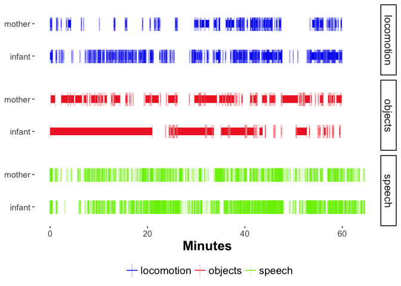

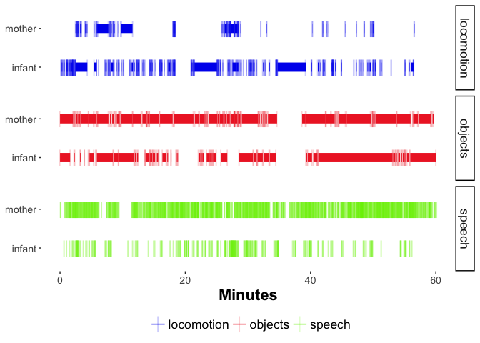
</div>

## All 'gold standard' subs mins 0-10

<div class="centered">

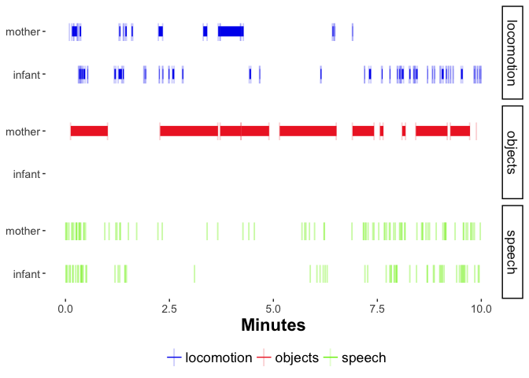
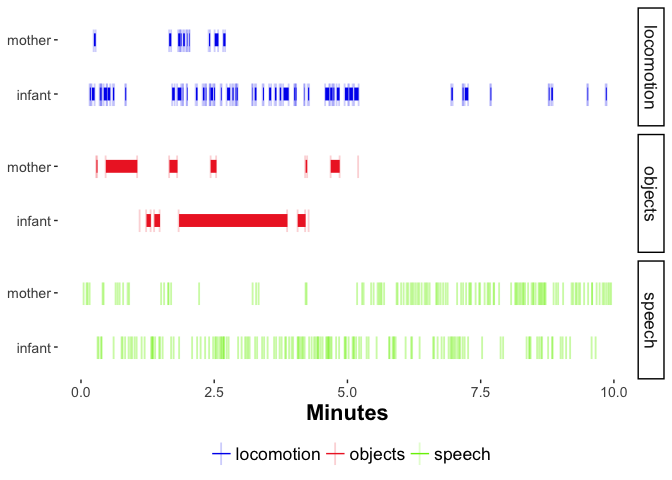

</div>

## All 'gold standard' subs mins 10-20

<div class="centered">
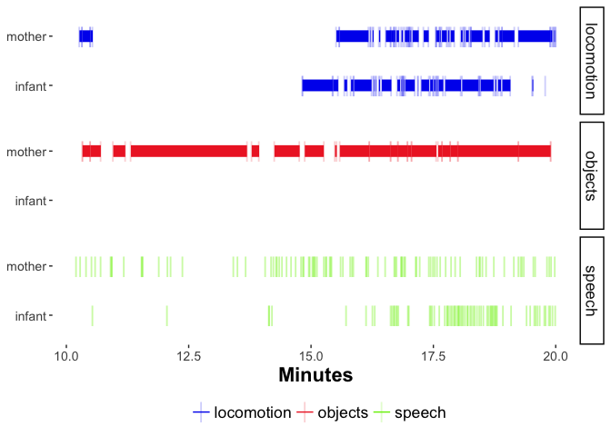
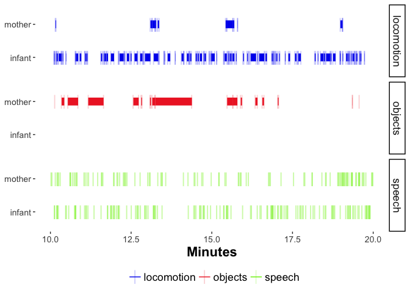
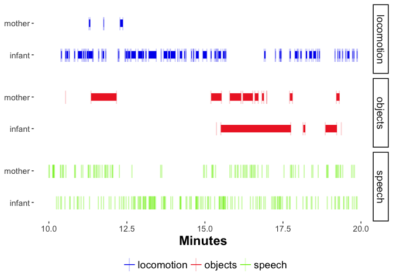
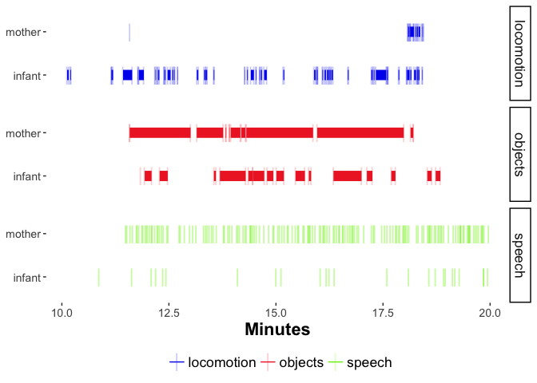
</div>

## All 'gold standard' subs mins 20-30

<div class="centered">
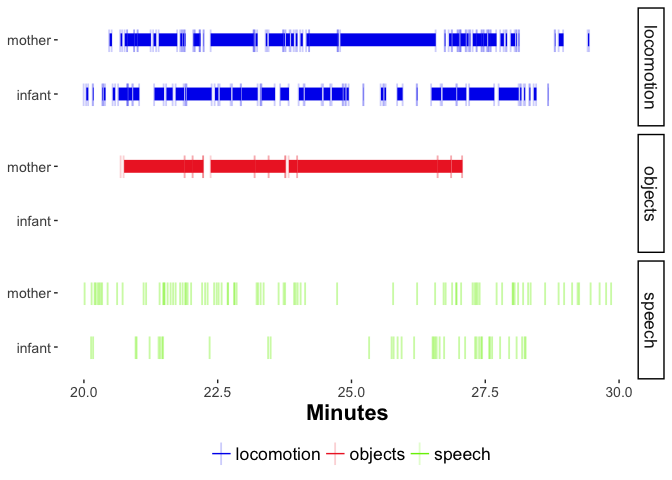
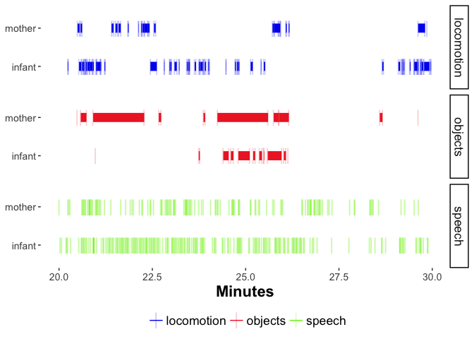
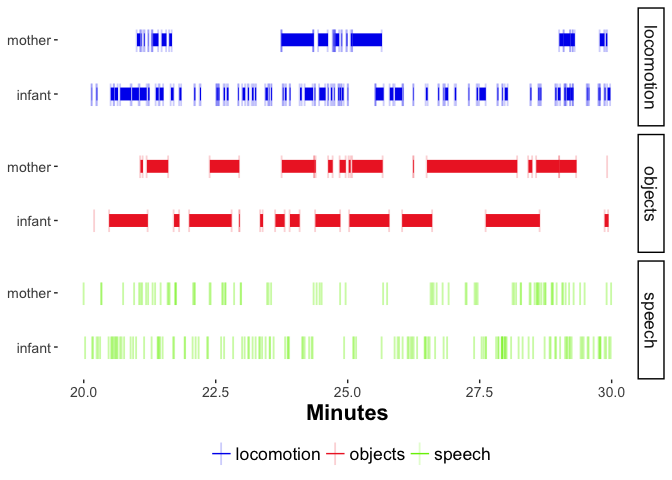

</div>

## All 'gold standard' subs mins 30-40

<div class="centered">


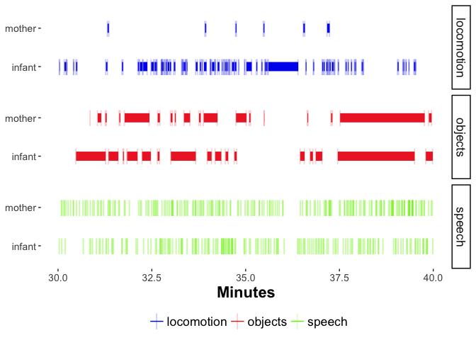
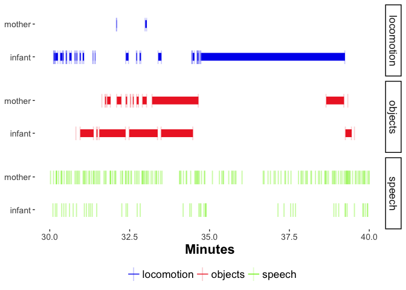
</div>

## All 'gold standard' subs mins 40-50

<div class="centered">
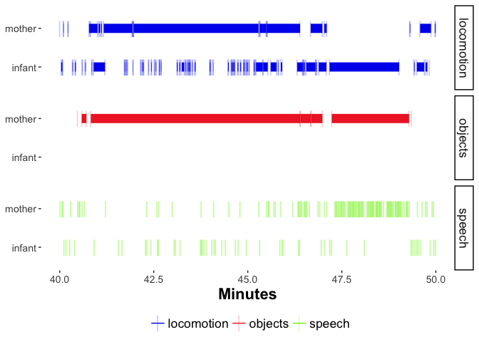
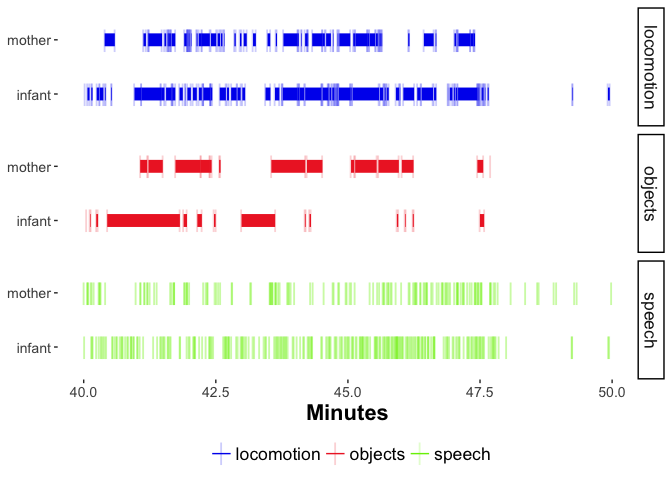


</div>

## All 'gold standard' subs mins 50-60

<div class="centered">
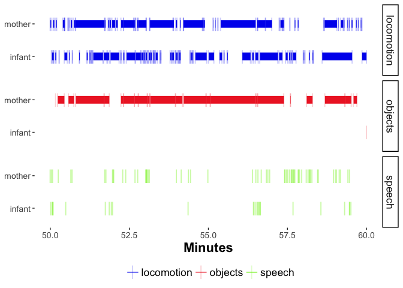
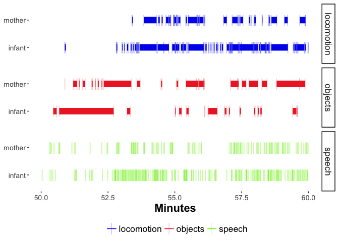
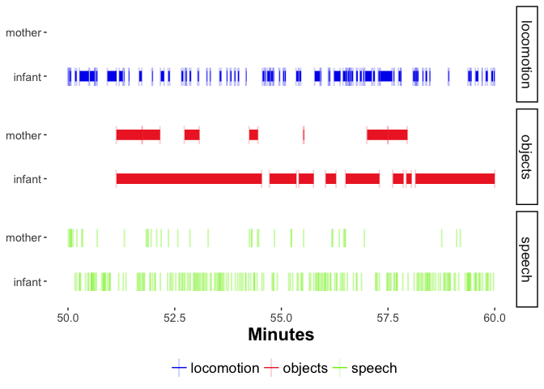

</div>


