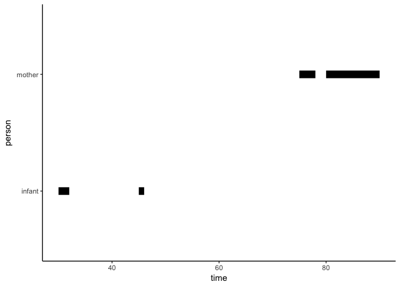
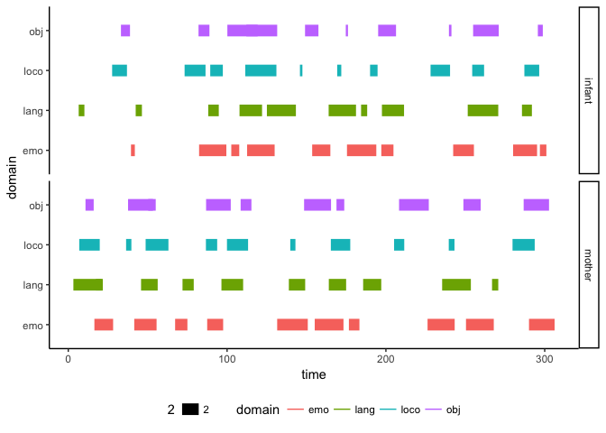

timeline-visualization-testing
================
Rick Gilmore
2018-04-03 14:25:56

Purpose
-------

To create attractive visualizations of timelines of coded behaviors from PLAY project Datavyu spreadsheets.

Requirements
------------

-   Show mom and infant time lines by behavioral domain/code

Generate sample data
--------------------

``` r
onset <- c(30, 45, 75, 80)
offset <- c(32, 46, 78, 90)
person <- c('infant', 'infant', 'mother', 'mother')
# Grouping by bout.id allows line segments
bout <- c(1, 2, 3, 4)

sample.1 <- data.frame(bout, person, onset, offset)
```

Sample plot
-----------

``` r
sample.1 %>%
  gather(., key = event, value = time, onset, offset) %>%
  ggplot() +
  aes(x = time, y = person, group = bout) +
  geom_line(aes(size = 2)) +
  theme_classic() +
  theme(legend.position = "none")
```



Ok, this looks promising. Let's add some additional variables, including some for different 'domains' of codes.

Sample data set 2
-----------------

``` r
onset.i <- sort(runif(n = 40, min = 1, max = 300))
onset.m <- sort(runif(n = 40, min = 1, max = 300))
offset.i <- onset.i + runif(n = 40, min = 1, max = 20)
offset.m <- onset.m + runif(n = 40, min = 1, max = 20)
onset <- c(onset.i, onset.m)
offset <- c(offset.i, offset.m)
person <- rep(c("infant", "mother"), each = 40)
bout <- 1:length(onset)
domain <- rep(c("lang", "loco", "obj", "emo"), 20)

sample.2 <- data.frame(person, domain, bout, onset, offset)
```

Now, let's plot.

``` r
sample.2 %>%
  gather(., key = event, value = time, onset, offset) %>%
  ggplot() +
  aes(x = time, y = domain, group = bout, fill = domain) +
  geom_line(aes(size = 2, color = domain)) +
  facet_grid(person ~ .) +
  theme_classic() +
  theme(legend.position = "bottom")
```



So, data in the following format can be easily plotted as a time line:

``` r
sample.2 %>%
  knitr::kable(.)
```

| person | domain |  bout|       onset|     offset|
|:-------|:-------|-----:|-----------:|----------:|
| infant | lang   |     1|    6.563150|   10.15614|
| infant | loco   |     2|   27.620655|   36.95782|
| infant | obj    |     3|   33.172319|   38.86634|
| infant | emo    |     4|   39.490294|   41.91197|
| infant | lang   |     5|   42.453203|   46.37053|
| infant | loco   |     6|   73.246954|   86.42606|
| infant | obj    |     7|   82.022032|   88.88985|
| infant | emo    |     8|   82.377378|   99.53354|
| infant | lang   |     9|   88.129535|   94.76645|
| infant | loco   |    10|   89.389663|   97.32308|
| infant | obj    |    11|  100.173791|  119.25336|
| infant | emo    |    12|  102.650141|  107.66138|
| infant | lang   |    13|  107.827755|  122.01843|
| infant | loco   |    14|  111.463099|  131.05765|
| infant | obj    |    15|  112.139168|  131.55431|
| infant | emo    |    16|  112.608172|  129.94090|
| infant | lang   |    17|  125.062895|  143.32791|
| infant | loco   |    18|  145.871157|  147.42347|
| infant | obj    |    19|  149.079897|  157.51881|
| infant | emo    |    20|  153.576476|  165.02175|
| infant | lang   |    21|  163.952746|  181.17358|
| infant | loco   |    22|  169.331996|  171.90636|
| infant | obj    |    23|  174.742818|  176.11989|
| infant | emo    |    24|  175.496317|  193.95411|
| infant | lang   |    25|  184.371771|  188.21426|
| infant | loco   |    26|  190.029725|  194.74986|
| infant | obj    |    27|  195.129290|  206.37513|
| infant | emo    |    28|  197.113611|  204.76323|
| infant | lang   |    29|  197.498664|  211.42296|
| infant | loco   |    30|  228.119054|  240.39481|
| infant | obj    |    31|  239.695779|  241.27073|
| infant | emo    |    32|  242.367109|  255.40974|
| infant | lang   |    33|  251.523759|  270.74939|
| infant | loco   |    34|  254.344770|  261.82262|
| infant | obj    |    35|  254.919346|  271.05265|
| infant | emo    |    36|  280.100907|  295.18278|
| infant | lang   |    37|  285.675106|  291.92521|
| infant | loco   |    38|  287.192871|  296.53052|
| infant | obj    |    39|  295.678339|  298.79492|
| infant | emo    |    40|  296.963691|  301.04559|
| mother | lang   |    41|    3.220565|   20.93652|
| mother | loco   |    42|    6.911871|   19.81387|
| mother | obj    |    43|   10.849656|   16.00589|
| mother | emo    |    44|   16.446527|   28.23981|
| mother | lang   |    45|   17.382501|   21.73930|
| mother | loco   |    46|   36.410782|   39.73919|
| mother | obj    |    47|   37.650383|   53.32194|
| mother | emo    |    48|   41.544730|   55.59767|
| mother | lang   |    49|   45.833060|   56.30211|
| mother | loco   |    50|   48.713260|   63.06779|
| mother | obj    |    51|   50.363202|   55.06595|
| mother | emo    |    52|   67.277911|   75.01546|
| mother | lang   |    53|   71.936565|   78.99581|
| mother | loco   |    54|   86.668911|   93.75961|
| mother | obj    |    55|   86.775334|  102.30827|
| mother | emo    |    56|   87.474241|   97.52476|
| mother | lang   |    57|   96.443427|  110.10606|
| mother | loco   |    58|   99.924323|  113.21719|
| mother | obj    |    59|  108.527798|  115.31857|
| mother | emo    |    60|  131.547684|  150.81172|
| mother | lang   |    61|  138.891551|  149.17533|
| mother | loco   |    62|  139.781742|  143.03717|
| mother | obj    |    63|  148.486675|  165.45084|
| mother | emo    |    64|  155.190529|  173.29397|
| mother | lang   |    65|  164.057630|  174.95743|
| mother | loco   |    66|  165.331653|  177.55878|
| mother | obj    |    67|  168.883084|  173.78033|
| mother | emo    |    68|  176.703138|  183.32819|
| mother | lang   |    69|  185.672531|  197.07360|
| mother | loco   |    70|  205.160749|  211.55139|
| mother | obj    |    71|  208.288173|  227.00472|
| mother | emo    |    72|  226.229083|  243.30585|
| mother | lang   |    73|  235.414693|  253.49682|
| mother | loco   |    74|  239.580967|  243.18452|
| mother | obj    |    75|  248.802498|  259.69175|
| mother | emo    |    76|  250.431449|  267.92256|
| mother | lang   |    77|  266.832623|  270.75937|
| mother | loco   |    78|  279.735779|  293.69723|
| mother | obj    |    79|  286.738919|  302.71534|
| mother | emo    |    80|  290.106577|  306.22348|
