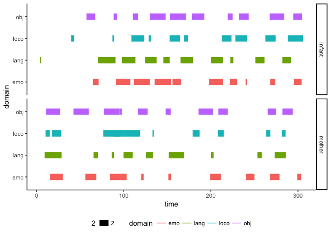

timeline-visualization-testing
================
Rick Gilmore
2018-04-04 09:31:35

Purpose
-------

To create attractive visualizations of timelines of coded behaviors from PLAY project Datavyu spreadsheets.

Requirements
------------

-   Show mom and infant time lines by behavioral domain/code

Example 1
---------

### Generate sample data

``` r
onset <- c(30, 45, 75, 80)
offset <- c(32, 46, 78, 90)
person <- c('infant', 'infant', 'mother', 'mother')
# Grouping by bout.id allows line segments
bout <- c(1, 2, 3, 4)

sample.1 <- data.frame(bout, person, onset, offset)
```

### Sample plot

``` r
sample.1 %>%
  gather(., key = event, value = time, onset, offset) %>%
  ggplot() +
  aes(x = time, y = person, group = bout) +
  geom_line(aes(size = 2)) +
  theme_classic() +
  theme(legend.position = "none")
```


Ok, this looks promising. Let's add some additional variables, including some for different 'domains' of codes.

Example 2
---------

### Generate data

``` r
onset.i <- sort(runif(n = 40, min = 1, max = 300))
onset.m <- sort(runif(n = 40, min = 1, max = 300))
offset.i <- onset.i + runif(n = 40, min = 1, max = 20)
offset.m <- onset.m + runif(n = 40, min = 1, max = 20)
onset <- c(onset.i, onset.m)
offset <- c(offset.i, offset.m)
person <- rep(c("infant", "mother"), each = 40)
bout <- 1:length(onset)
domain <- rep(c("lang", "loco", "obj", "emo"), 20)

sample.2 <- data.frame(person, domain, bout, onset, offset)
```

Now, let's plot.

``` r
sample.2 %>%
  gather(., key = event, value = time, onset, offset) %>%
  ggplot() +
  aes(x = time, y = domain, group = bout, fill = domain) +
  geom_line(aes(size = 2, color = domain)) +
  facet_grid(person ~ .) +
  theme_classic() +
  theme(legend.position = "bottom")
```



So, data in the following format can be easily plotted as a time line:

``` r
sample.2 %>%
  knitr::kable(.)
```

| person | domain |  bout|       onset|      offset|
|:-------|:-------|-----:|-----------:|-----------:|
| infant | lang   |     1|    3.992504|    5.086067|
| infant | loco   |     2|   39.564471|   42.933262|
| infant | obj    |     3|   57.215176|   67.312519|
| infant | emo    |     4|   64.700314|   71.236044|
| infant | lang   |     5|   70.580752|   90.571286|
| infant | loco   |     6|   87.052885|   89.087504|
| infant | obj    |     7|   88.359844|   92.090740|
| infant | emo    |     8|   90.851664|  107.568181|
| infant | lang   |     9|   97.903138|  113.454693|
| infant | loco   |    10|  108.743235|  123.628646|
| infant | obj    |    11|  110.469970|  116.441130|
| infant | emo    |    12|  111.647376|  130.062472|
| infant | lang   |    13|  124.660580|  137.676105|
| infant | loco   |    14|  128.572006|  131.366632|
| infant | obj    |    15|  130.301258|  148.118006|
| infant | emo    |    16|  135.377857|  154.314259|
| infant | lang   |    17|  145.462185|  152.789916|
| infant | loco   |    18|  152.741245|  164.558213|
| infant | obj    |    19|  152.936343|  171.402965|
| infant | emo    |    20|  156.020903|  165.857019|
| infant | lang   |    21|  165.163790|  179.593110|
| infant | loco   |    22|  169.173416|  173.923525|
| infant | obj    |    23|  178.212521|  192.588552|
| infant | emo    |    24|  197.885030|  213.978044|
| infant | lang   |    25|  200.134611|  213.961731|
| infant | loco   |    26|  212.432774|  223.659852|
| infant | obj    |    27|  219.446448|  225.018212|
| infant | emo    |    28|  221.927095|  230.059400|
| infant | lang   |    29|  222.304211|  225.768493|
| infant | loco   |    30|  228.157473|  241.361693|
| infant | obj    |    31|  232.152392|  243.348621|
| infant | emo    |    32|  239.855620|  241.234621|
| infant | lang   |    33|  251.054778|  261.589025|
| infant | loco   |    34|  262.527954|  274.365579|
| infant | obj    |    35|  267.528096|  284.253797|
| infant | emo    |    36|  268.047361|  273.892151|
| infant | lang   |    37|  282.089346|  292.046779|
| infant | loco   |    38|  288.337182|  305.652243|
| infant | obj    |    39|  294.561806|  304.701481|
| infant | emo    |    40|  295.334485|  304.176727|
| mother | lang   |    41|    9.244943|   28.637807|
| mother | loco   |    42|   10.291493|   15.019884|
| mother | obj    |    43|   11.036788|   27.082254|
| mother | emo    |    44|   15.679645|   30.203913|
| mother | lang   |    45|   15.972165|   19.661007|
| mother | loco   |    46|   17.448823|   28.153400|
| mother | obj    |    47|   42.354444|   59.835770|
| mother | emo    |    48|   55.974554|   68.441443|
| mother | lang   |    49|   65.298566|   70.410335|
| mother | loco   |    50|   76.479308|   95.816422|
| mother | obj    |    51|   77.148749|   94.437517|
| mother | emo    |    52|   84.060038|  103.286442|
| mother | lang   |    53|   86.195926|   88.643646|
| mother | loco   |    54|   88.198220|  100.342026|
| mother | obj    |    55|   94.942261|   97.857416|
| mother | emo    |    56|   98.079929|  102.075652|
| mother | lang   |    57|   99.721142|  110.347336|
| mother | loco   |    58|  100.469185|  118.826384|
| mother | obj    |    59|  116.292701|  127.403472|
| mother | emo    |    60|  120.088176|  122.873027|
| mother | lang   |    61|  125.356200|  133.556645|
| mother | loco   |    62|  132.999482|  134.449713|
| mother | obj    |    63|  148.124399|  153.970202|
| mother | emo    |    64|  151.241595|  154.312960|
| mother | lang   |    65|  151.710381|  169.240934|
| mother | loco   |    66|  179.060638|  187.126828|
| mother | obj    |    67|  185.860186|  202.550410|
| mother | emo    |    68|  199.243148|  211.559231|
| mother | lang   |    69|  199.939612|  203.124966|
| mother | loco   |    70|  208.175787|  214.906731|
| mother | obj    |    71|  208.612621|  219.495314|
| mother | emo    |    72|  240.205691|  249.967464|
| mother | lang   |    73|  253.410153|  258.537955|
| mother | loco   |    74|  263.393491|  268.303409|
| mother | obj    |    75|  265.251220|  274.962579|
| mother | emo    |    76|  267.902203|  278.826713|
| mother | lang   |    77|  273.253806|  285.996959|
| mother | loco   |    78|  281.333894|  285.696984|
| mother | obj    |    79|  282.144152|  294.054319|
| mother | emo    |    80|  299.071078|  303.526895|

Example 3: Working with an actual exported Datavyu file
-------------------------------------------------------

There are sample Datavyu files from the 'gold standard' videos (minus the emotion coding) in `analysis/csv/`. Let's see if we can use a comparable workflow to visualize these data.

``` r
sub.id <- 'nyu_18'
fn <- paste0("analysis/csv/", sub.id, ".csv")
dv <- read.csv(fn, stringsAsFactors = FALSE)

# Select subset of key variables, especially ordinals, onsets, & offsets
dv %>%
  select(babyloc.ordinal, babyloc.onset, babyloc.offset,
         babyobject.ordinal, babyobject.onset, babyobject.offset,
         babyvoc.ordinal, babyvoc.onset, babyvoc.offset,
         momloc.ordinal, momloc.onset, momloc.offset,
         momobject.ordinal, momobject.onset, momobject.offset,
         momspeech.ordinal, momspeech.onset, momspeech.offset) ->
  dv

# Remove NAs and make ordinals unique within domains for later grouping
dv %>%
  filter(!is.na(babyloc.ordinal), !is.na(momloc.ordinal),
         !is.na(babyobject.ordinal), !is.na(momobject.ordinal),
         !is.na(babyvoc.ordinal), !is.na(momspeech.ordinal)) %>%
  filter(!is.na(babyloc.onset), !is.na(momloc.onset),
         !is.na(babyobject.onset), !is.na(momobject.onset),
         !is.na(babyvoc.onset), !is.na(momspeech.onset)) %>%
   filter(!is.na(babyloc.offset), !is.na(momloc.offset),
         !is.na(babyobject.offset), !is.na(momobject.offset),
         !is.na(babyvoc.offset), !is.na(momspeech.offset)) ->
  dv

dv %>%
  mutate(., b.loc.bout = paste0('b.loc.', babyloc.ordinal)) %>%
  mutate(., m.loc.bout = paste0('m.loc.', momloc.ordinal)) %>%
  mutate(., b.obj.bout = paste0('b.obj.', babyobject.ordinal)) %>%
  mutate(., m.obj.bout = paste0('m.obj.', momobject.ordinal)) %>%
  mutate(., b.voc.bout = paste0('b.voc.', babyvoc.ordinal)) %>%
  mutate(., m.voc.bout = paste0('m.voc.', momspeech.ordinal)) ->
  dv1

# Gather for onsets and offsets
dv1 %>%
  gather(key = bout.lbl, value = bout, b.loc.bout, m.loc.bout, b.obj.bout, m.obj.bout,
         b.voc.bout, m.voc.bout) %>%
  arrange(bout) ->
  dv2
  
dv2 %>%
  gather(key = event, value = time.ms, 
         babyloc.onset, babyloc.offset, babyobject.onset, babyobject.offset,
         babyvoc.onset, babyvoc.offset, momloc.onset, momloc.offset, 
         momobject.onset, momobject.offset, momspeech.onset, momspeech.offset) %>%
  mutate(event = str_extract(event, "[onsetf]+$")) %>%
  mutate(person = substr(bout.lbl, 1, 1)) %>%
  mutate(domain = substr(bout.lbl, 3, 5)) %>%
  select(person, domain, bout, event, time.ms) ->
  dv2
```

Okay, now that we've munged the data, let's plot.

``` r
dv2 %>%
  filter(time.ms < 1000*60*3) %>%
  ggplot() +
  aes(x = time.ms, y = domain, group = bout, fill = domain) +
  geom_line(aes(size = 2, color = domain)) +
  facet_grid(person ~ .) +
  theme_classic() +
  theme(legend.position = "bottom")
```


Looks like all the NA's got grouped.

The 'elegant' way isn't working, so let's try an approach that separates the different domains.

``` r
sub.id <- 'nyu_18'
fn <- paste0("analysis/csv/", sub.id, ".csv")
dv <- read.csv(fn, stringsAsFactors = FALSE)

dv %>%
  select(., babyloc.ordinal, babyloc.onset, babyloc.offset) %>%
  gather(., key = event, value = time.ms, -babyloc.ordinal) %>%
  mutate(., event = str_extract(event, "[onsetf]+$")) %>%
  mutate(., ordinal = paste0('b.loc.', babyloc.ordinal)) %>%
  mutate(., person = "infant") %>%
  select(-babyloc.ordinal) %>%
  arrange(., time.ms) ->
  dv.babyloc

dv %>%
  select(., momloc.ordinal, momloc.onset, momloc.offset) %>%
  gather(., key = event, value = time.ms, -momloc.ordinal) %>%
  mutate(., event = str_extract(event, "[onsetf]+$")) %>%
  mutate(., ordinal = paste0('m.loc.', momloc.ordinal)) %>%
  mutate(., person = "mother") %>%
  select(-momloc.ordinal) %>%
  arrange(., time.ms) ->
  dv.momloc

dv.loc <- rbind(dv.babyloc, dv.momloc)
dv.loc$domain = "locomotion"

dv.loc %>%
  filter(time.ms < 1000*60*3) %>%
  ggplot() +
  aes(x = time.ms, y = person, group = ordinal) +
  geom_line(aes(size = 2))
```


``` r
dv %>%
  select(., babyobject.ordinal, babyobject.onset, babyobject.offset) %>%
  gather(., key = event, value = time.ms, -babyobject.ordinal) %>%
  mutate(., event = str_extract(event, "[onsetf]+$")) %>%
  mutate(., ordinal = paste0('b.obj.', babyobject.ordinal)) %>%
  mutate(., person = "infant") %>%
  select(-babyobject.ordinal) %>%
  arrange(., time.ms) ->
  dv.babyobj

dv %>%
  select(., momobject.ordinal, momobject.onset, momobject.offset) %>%
  gather(., key = event, value = time.ms, -momobject.ordinal) %>%
  mutate(., event = str_extract(event, "[onsetf]+$")) %>%
  mutate(., ordinal = paste0('m.obj.', momobject.ordinal)) %>%
  mutate(., person = "mother") %>%
  select(-momobject.ordinal) %>%
  arrange(., time.ms) ->
  dv.momobj

dv.obj <- rbind(dv.babyobj, dv.momobj)
dv.obj$domain = "objects"

dv %>%
  select(., babyvoc.ordinal, babyvoc.onset, babyvoc.offset) %>%
  gather(., key = event, value = time.ms, -babyvoc.ordinal) %>%
  mutate(., event = str_extract(event, "[onsetf]+$")) %>%
  mutate(., ordinal = paste0('b.voc.', babyvoc.ordinal)) %>%
  mutate(., person = "infant") %>%
  select(-babyvoc.ordinal) %>%
  arrange(., time.ms) ->
  dv.babyvoc

dv %>%
  select(., momspeech.ordinal, momspeech.onset, momspeech.offset) %>%
  gather(., key = event, value = time.ms, -momspeech.ordinal) %>%
  mutate(., event = str_extract(event, "[onsetf]+$")) %>%
  mutate(., ordinal = paste0('m.voc.', momspeech.ordinal)) %>%
  mutate(., person = "mother") %>%
  select(-momspeech.ordinal) %>%
  arrange(., time.ms) ->
  dv.momspeech

dv.voc <- rbind(dv.babyvoc, dv.momspeech)
dv.voc$domain = "speech"
```

Let's plot the separate domains.

``` r
dv.obj %>%
  filter(time.ms < 1000*60*5) %>%
  ggplot() +
  aes(x = time.ms, y = person, group = ordinal) +
  geom_line(aes(size = 2))
```


``` r
dv.voc %>%
  filter(time.ms < 1000*60*3) %>%
  ggplot() +
  aes(x = time.ms, y = person, group = ordinal) +
  geom_point() +
  geom_line(aes(size = 2))
```


Infant and mother vocalization and speech events have offset == onset!

Putting it all together.

``` r
dv.nyu18 <- rbind(dv.loc, dv.obj, dv.voc)
dv.nyu18 %>%
  arrange(time.ms) ->
  dv.nyu18

dv.nyu18 %>%
  filter(time.ms < 1000*60*5) %>%
  ggplot() +
  aes(x = (time.ms)/(60*1000), y = domain, group = ordinal, color = domain) +
  geom_point() +
  geom_line() +
  facet_grid(person ~ .) +
  xlab("Min")
```


Ok, so this is a start. I'd still like to find a more `tidyverse` compatible way to do the munging. But sometimes a hack is the best way to start.
