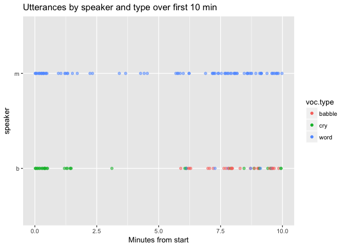
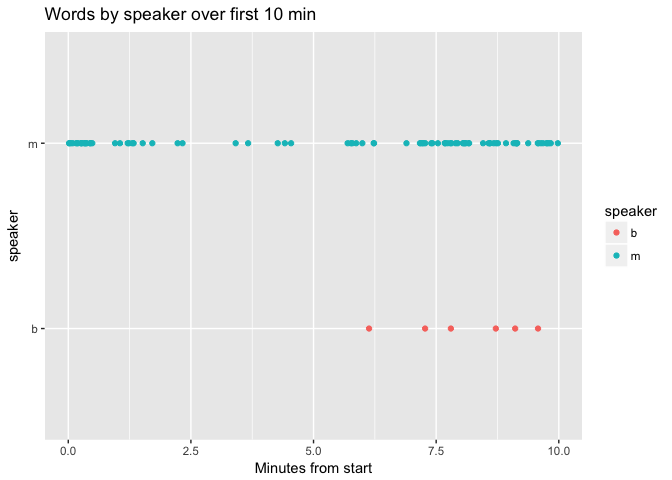
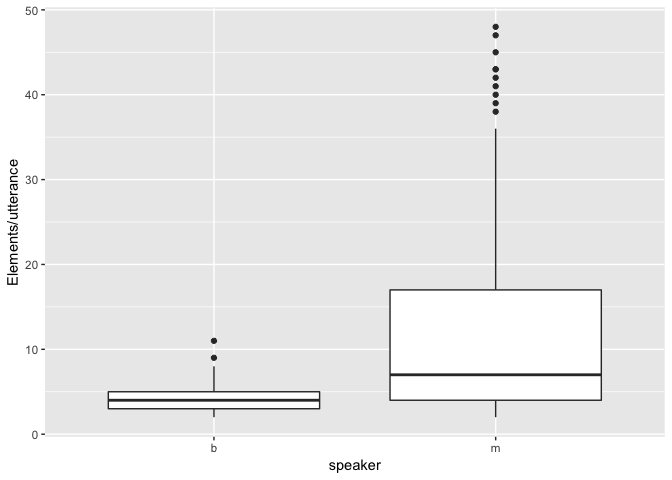
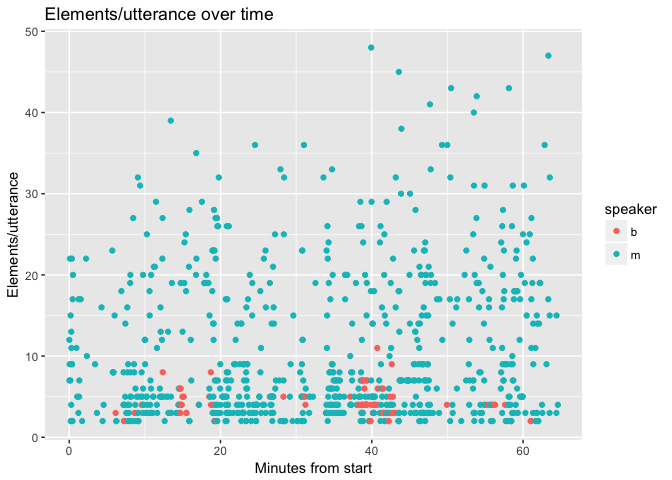
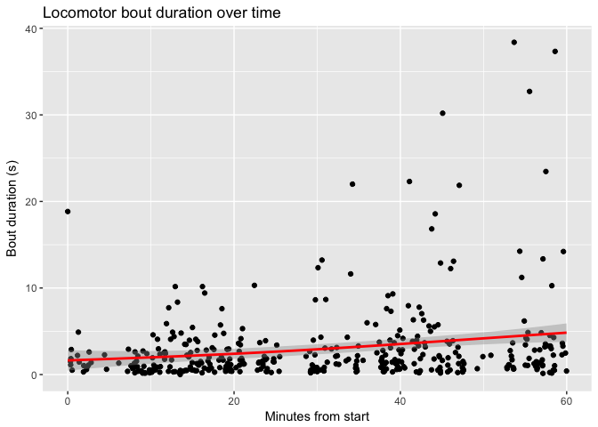
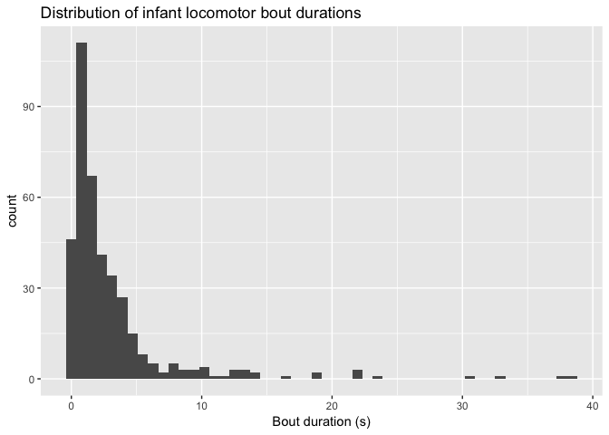
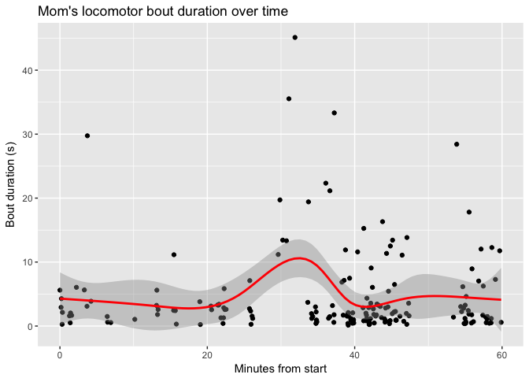
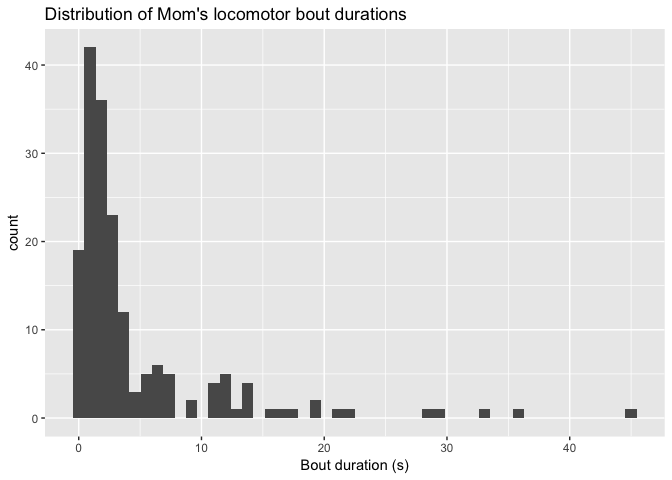
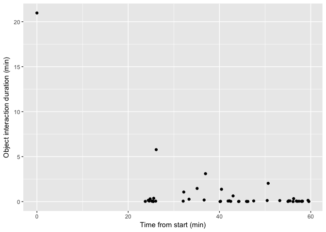
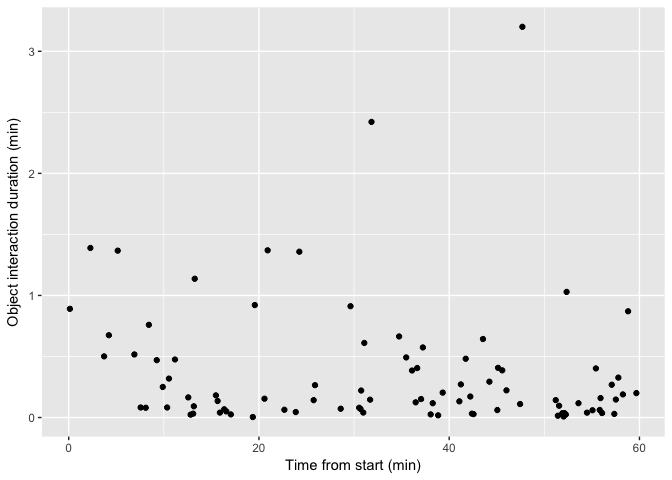

video-code-file-munging
================
Rick Gilmore
2017-04-08 07:27:13

Background
----------

This file describes the steps involved in exporting and cleaning a PLAY project Datavyu video coding file.

Datavyu steps
-------------

1.  Open the \*.opf file.
2.  Select `PrintSingleFile.rb` from the `Script` menu.
3.  Export the file as `<SITE_ID>_<PARTICIPANT_ID>.csv`
4.  Save in `analysis/csv/` relative to the directory of this report.

RStudio steps
-------------

1.  Enter `rmarkdown::render("video-code-file-export-cleaning.Rmd", params = list(sub_id=<SUB_ID>))` at the console, substituting `<SITE_ID>_<PARTICIPANT_ID>` for `<SUB_ID>`.

<!-- Fix this so it changes the output file name and saves the HTML report to a separate directory -->
Open and clean CSV
------------------

``` r
fn <- paste0("analysis/csv/", params$sub_id, ".csv")
dv <- read.csv(fn, stringsAsFactors = FALSE)
```

Transcription
-------------

Details about the coding may be found here:

<https://dev1.ed-projects.nyu.edu/wikis/docuwiki/doku.php/transcription>

``` r
ord <- dv$transcribe.ordinal
# ordinals start at 0

on <- dv$transcribe.onset
# number is ms

content <- dv$transcribe.content
speaker <- dv$transcribe.source
```

The content variable contains lots of single character "c" codes (for crying) and "b" codes (for babbling). If we're interested in words only, those and other actions in square brackets should probably be eliminated.

``` r
# the "\\[*\\]" string is a regular expression that matches any
# characters that lie between square brackets.
speech.cry <- (content == "c") 
speech.babble <- (content == "b")
speech.other <- str_detect(content, "\\[*\\]")
speech.words <- !(speech.cry | speech.babble | speech.other)

voc.type <- content
voc.type[speech.cry] <- "cry"
voc.type[speech.babble] <- "babble"
voc.type[speech.other] <- "other"
voc.type[speech.words] <- "word"

transcript <- data.frame(ordinal = 1 + ord,
                         on.secs = on/1000,
                         speaker = speaker,
                         content = content,
                         voc.type = voc.type)
```

### Vocalizations by type

``` r
transcript %>%
  filter(on.secs <= 10*60) %>% # first 10 min
  ggplot() +
  aes(x = on.secs/60, y = speaker, 
      color = voc.type, alpha = .50) +
  geom_point() +
  ggtitle("Utterances by speaker and type over first 10 min") +
  xlab("Minutes from start") +
  guides(alpha=FALSE)
```



### Words

``` r
transcript %>%
  filter(on.secs <= 10*60) %>% # first 10 min
  filter(voc.type == "word") %>%
  ggplot() +
  aes(x = on.secs/60, y = speaker, 
      color = speaker) +
  geom_point() +
  ggtitle("Words by speaker over first 10 min") +
  xlab("Minutes from start")
```



### Utterance length

``` r
transcript %>%
  filter(voc.type == "word") %>%
  mutate(utt.count = str_count(content)) %>%
  ggplot() +
  aes(x=speaker, y=utt.count) +
  geom_boxplot() +
  ylab("Elements/utterance")
```



``` r
transcript %>%
  filter(voc.type == "word") %>%
  mutate(utt.count = str_count(content)) %>%
  ggplot() +
  aes(x = on.secs/60, y = utt.count,
      color = speaker) +
  geom_point() +
  xlab("Minutes from start") +
  ylab("Elements/utterance") +
  ggtitle("Elements/utterance over time")
```



Locomotion
----------

For details about the locomotion codes, see:

<https://dev1.ed-projects.nyu.edu/wikis/docuwiki/doku.php/manual4>

``` r
# ordinals start at 0
mom.ord <- dv$momloc.ordinal

# number is frames. Need to know FPS to compute time
mom.on <- dv$momloc.onset
mom.off <- dv$momloc.offset

baby.ord <- dv$babyloc.ordinal
baby.on <- dv$babyloc.onset
baby.off <- dv$babyloc.offset

locomotion <- data.frame(mom.ord = 1 + mom.ord,
                         mom.on = mom.on/1000,
                         mom.off = mom.off/1000,
                         baby.ord = 1 + baby.ord,
                         baby.on = baby.on/1000,
                         baby.off = baby.off/1000)
```

### Infant

``` r
locomotion %>%
  mutate(mom.secs = mom.off - mom.on,
         baby.secs = baby.off - baby.on) ->
locomotion

locomotion %>%
  ggplot() +
  aes(x = baby.on/60, y = baby.secs) +
  geom_point() +
  geom_smooth(color = "red") + 
  ggtitle("Locomotor bout duration over time") +
  xlab("Minutes from start") +
  ylab("Bout duration (s)")
```

    ## `geom_smooth()` using method = 'gam'

    ## Warning: Removed 1466 rows containing non-finite values (stat_smooth).

    ## Warning: Removed 1466 rows containing missing values (geom_point).



``` r
locomotion %>%
  ggplot() +
  aes(x = baby.secs) +
  geom_histogram(bins = 50) +
  ggtitle("Distribution of infant locomotor bout durations") +
  xlab("Bout duration (s)")
```

    ## Warning: Removed 1466 rows containing non-finite values (stat_bin).



### Mother

``` r
locomotion %>%
  ggplot() +
  aes(x = mom.on/60, y = mom.secs) +
  geom_point() +
  geom_smooth(color = "red") + 
  ggtitle("Mom's locomotor bout duration over time") +
  xlab("Minutes from start") +
  ylab("Bout duration (s)")
```

    ## `geom_smooth()` using method = 'gam'

    ## Warning: Removed 1679 rows containing non-finite values (stat_smooth).

    ## Warning: Removed 1679 rows containing missing values (geom_point).



``` r
locomotion %>%
  ggplot() +
  aes(x = mom.secs) +
  geom_histogram(bins = 50) +
  ggtitle("Distribution of Mom's locomotor bout durations") +
  xlab("Bout duration (s)")
```

    ## Warning: Removed 1679 rows containing non-finite values (stat_bin).



Objects
-------

For details about the object codes, see:

<https://dev1.ed-projects.nyu.edu/wikis/docuwiki/doku.php/manual3>

``` r
objects <- data.frame(babyobject.ordinal = dv$babyobject.ordinal + 1,
                      babyobject.onset = dv$babyobject.onset,
                      babyobject.offset = dv$babyobject.offset,
                      momobject.ordinal = dv$babyobject.ordinal + 1,
                      momobject.onset = dv$momobject.onset,
                      momobject.offset = dv$momobject.offset)

# Compute durations in msec
objects %>%
  mutate(babyobject.msec = babyobject.offset - babyobject.onset,
         momobject.msec = momobject.offset - momobject.onset) ->
  objects
```

### Infant

``` r
objects %>%
  ggplot() +
  # Divide milliseconds (msec) by 60 sec/min * 1000 msec/sec to get min
  aes(x = babyobject.onset/60000, y = babyobject.msec/60000) +
  geom_point() +
  xlab("Time from start (min)") +
  ylab("Object interaction duration (min)")
```

    ## Warning: Removed 1812 rows containing missing values (geom_point).



### Mother

``` r
objects %>%
  ggplot() +
  # Divide milliseconds (msec) by 60 sec/min * 1000 msec/sec to get min
  aes(x = momobject.onset/60000, y = momobject.msec/60000) +
  geom_point() +
  xlab("Time from start (min)") +
  ylab("Object interaction duration (min)")
```

    ## Warning: Removed 1768 rows containing missing values (geom_point).


